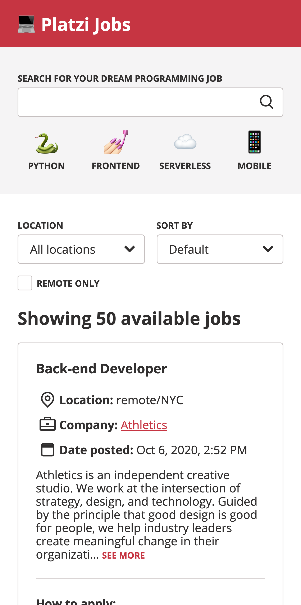

# Platzi Jobs

Platzi Jobs is a project I made to apply for the Frontend Developer position at Plazi. It gets data from [jobs.github.com](https://jobs.github.com/positions.json).

It's an accessible app that lets you search (input or popular search buttons) and filter the returned results.



## Technologies used

**1. React:** controls all the UI rendering and interactions

**2. Zustand:** a Redux alternative that handles all the global state

**3. Stylus:** preprocess the app styles

**4. Jest:** handles all the unit and integration tests

**5. React Testing Library:** provides utility functions to write maintainable tests for your React components

**6. Cypress:** handles the e2e test

**7. Node.js with express:** server side renders the app and [proxies the GitHub Jobs request to avoid the CORS restriction](https://github.com/public-apis/public-apis#jobs)

**8: Webpack:** processes and bundles all the app files

**Additional tools:** Prettier, ESLint

## Run the app locally

To run the app just install the dependencies and run the start script

```sh
yarn
yarn start
```

## Run Jest tests

Verify you have all the dependecies installed and run

```sh
yarn test
```

## Run Cypress tests

Verify you have all the dependecies installed and run

```sh
yarn test:e2e
```